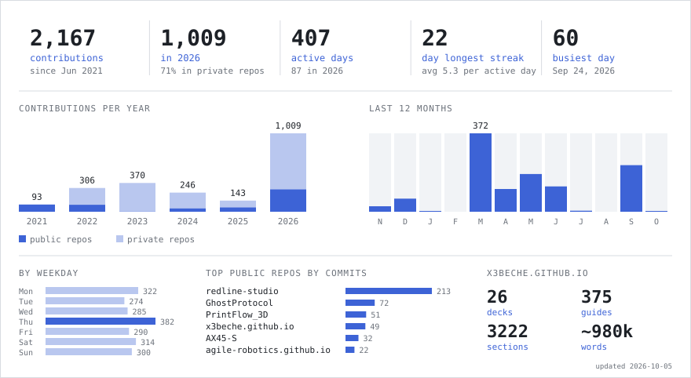

# Emirhan Pehlevan

Embedded Linux Candidate Researcher · TÜBİTAK BİLGEM  
B.Sc. Electrical & Electronics Engineering · Istanbul Medipol University (2026)

[x3beche.github.io](https://x3beche.github.io/) · [LinkedIn](https://www.linkedin.com/in/emirhanpehlevan/) · emirpehlevan@outlook.com

Embedded Linux, low-level C/C++ and hardware–software integration. Experience, projects and
my Turkish technical decks (embedded Linux, kernel, networking, AI, …) are on
[x3beche.github.io](https://x3beche.github.io/).

<picture>
  <source media="(prefers-color-scheme: dark)" srcset="assets/stats-dark.svg">
  
</picture>
